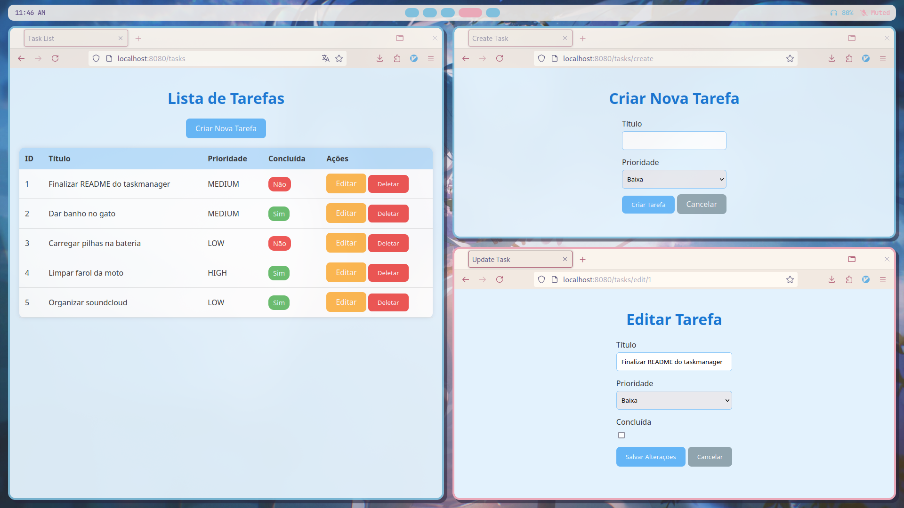

# Task Manager

Task Manager é uma aplicação web genérica para gerenciamento de itens. Construída utilizando Java, Spring Boot e Maven, a aplicação oferece funcionalidades de CRUD que permitem que os usuários criem, editem, deletem e listem itens com diferentes prioridades podendo ser adaptadas para diversos tipos de gerenciamento, como tarefas, estoques, inventários, vendas entre outros.



## Tecnologias Utilizadas

- **Java**: Linguagem de programação usada para o backend.
- **Spring Boot**: Framework usado para criar os serviços web.
- **Maven**: Ferramenta de gerenciamento de dependências e build.
- **Thymeleaf**: Motor de template para renderização de páginas HTML.
- **MariaDB**: Banco de dados usado para armazenar as tarefas.
- **Docker**: Ferramenta de containerização.
- **Docker Compose**: Ferramenta para definir e executar aplicações multi-container Docker.

## Dependências

- Docker
- Docker Compose
- Java 17
- Maven

## Executando a Aplicação

1. **Clone o repositório**:
    ```sh
    git clone https://github.com/awangelo/Task-Manager.git
    cd Task-Manager
    ```

2. **Construa as imagens Docker e execute a aplicação**:
    ```sh
    docker-compose up --build
    ```

3. **Acesse a aplicação**:
    `http://localhost:8080`.

## Estrutura do Projeto

- `src/main/java/com/github/awangelo/taskmanager`: Contém o código fonte Java.
- `src/main/resources/templates`: Contém os templates Thymeleaf.
- `Dockerfile`: Configuração Docker para construir a imagem da aplicação.
- `docker-compose.yaml`: Configuração Docker Compose para executar a aplicação e o banco de dados.

## Endpoints

- **GET /tasks**: Lista todas as tarefas.
- **GET /tasks/create**: Mostra o formulário para criar uma nova tarefa.
- **POST /tasks**: Cria uma nova tarefa.
- **GET /tasks/edit/{id}**: Mostra o formulário para editar uma tarefa.
- **POST /tasks/edit/{id}**: Atualiza uma tarefa.
- **POST /tasks/delete/{id}**: Deleta uma tarefa.

## Tratamento de Erros

- Página de erro personalizada para erros 404 com uma mensagem passada pelo `GlobalExceptionHandler`.